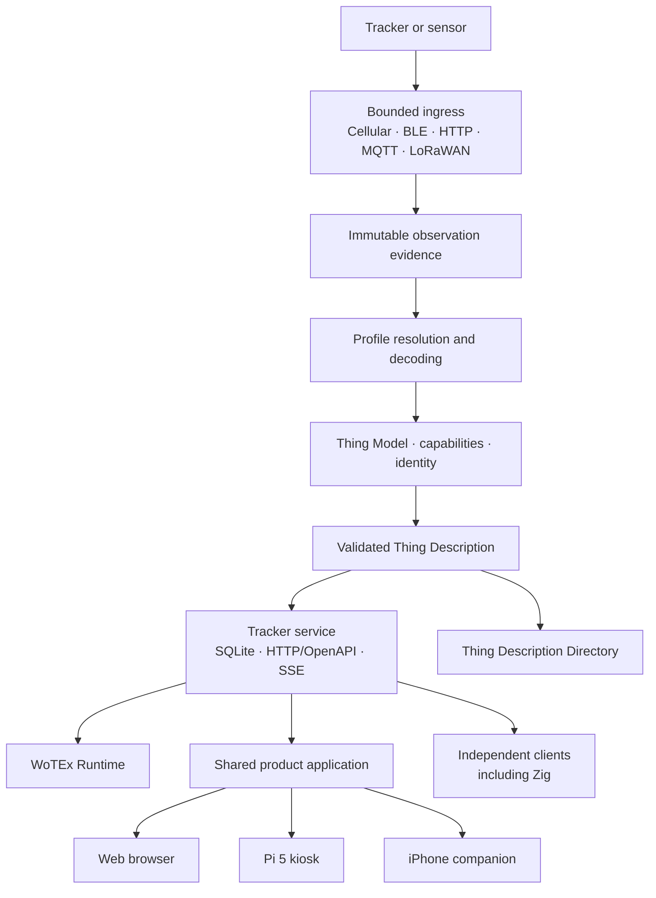

# Wotex Tracker

**Your trackers. Your infrastructure.**

WoTEx Tracker is a self-hosted asset-tracking system built around W3C Web of
Things contracts. It turns evidence from cellular trackers, BLE sensors and
other bounded inputs into durable tracking state, validated Thing Descriptions,
alerts, trip history and analytics.

The repository contains both the reusable Elixir/OTP library and the complete
product: a headless service, a shared LiveView application, a Raspberry Pi 5
kiosk, an iPhone companion and an independent Zig client. None of those hosts is
started by loading the library.

## Architecture

Transport is deliberately separate from meaning. A device can move between
supported ingress paths without changing the Properties, Actions and Events its
consumers understand.

## Current state

All repository-owned development targets are complete and pass local acceptance.
That means the full product can be developed and exercised with deterministic
simulators, including restart, offline, duplicate-ingress and authorization
failure paths. It does not turn simulator results into claims about physical
hardware or public providers.

| Area | What is implemented |
|---|---|
| Tracker pipeline | Bounded observations, deterministic profiles, versioned decoders, capability and identity evidence, Thing Model materialisation and validated TDs |
| Ingress | Teltonika TCP/Codec 8 Extended, passive BLE, authorized GATT probing and imported HTTP observations |
| Service | Durable SQLite state, recovery, scoped authorization, OpenAPI/HTTP, resumable SSE, Runtime interaction and store-and-forward |
| Tracking | Position history, geofences, motion, trips, heartbeat, battery, suspicious-movement and transport-health rules |
| Product UI | Enrollment, evidence review, maps, routes, protection rules, alerts, provisioning, telemetry and analytics |
| Hosts | Standalone service, shared browser application, Nerves headless/kiosk profiles and native iOS companion |
| Independent use | A Zig HTTP/SSE consumer that imports no Tracker domain code |

The final local composition drives one simulated tracker through the remote web
client, Pi client, mobile cache/native boundary and Zig client. It proves durable
recovery, offline/reconnect behavior, credential revocation and idempotent replay
without configuring a physical Action.

Latest verification snapshot:

| Gate | Result |
|---|---|
| Root | 217 tests, 19 generated properties, 1 doctest, 95.0% line coverage |
| Mobile | 93 tests, 95.3% line coverage, Zig checks and integrated scenario |
| Nerves | 52 headless tests and 56 kiosk tests |
| ARM64 virtual kiosk | Fresh boot and reboot; all 28 shared routes rendered |

The detailed chronology and exact command evidence live in the
[implementation log](docs/evidence/implementation.md). Machine-readable receipts
are retained for the [Zig/integrated scenario](verification/zig-native-development.json)
and [Nerves virtual kiosk](verification/nerves-qemu-kiosk-boot.json).

## Physical qualification

Local development is complete. The following claims still require the named
real system rather than another software seam:

- TAT140, EYE Sensor, modem, SIM, carrier and radio interoperability;
- Pi 5 display, touch, storage, power-loss and firmware-revert behavior;
- iPhone Keychain, CoreBluetooth, lifecycle, signing and installation;
- Apple provider acceptance, OS notification delivery and user interaction;
- public model-provider behavior and product distribution.

These are tracked independently so a missing device, account or distribution
channel cannot quietly weaken the software contracts. See the
[hardware qualification contract](docs/specs/WTR.09-hardware-qualification.md)
and [evidence policy](docs/specs/WTR.12-evidence-and-graduation.md).

## Start here

| If you want to… | Read… |
|---|---|
| Understand the product contracts | [Specification index](docs/specs/WTR-index.md) |
| Follow the evidence-to-Thing pipeline | [Materialisation guide](docs/guides/materialisation.md) |
| Integrate with the headless API | [Service contract](docs/contracts/service-v1.md) |
| Work on the product surfaces | [Application contract](docs/specs/WTR.15-product-and-mobile-applications.md) |
| Understand maps and offline context | [Map-pack contract](docs/contracts/map-pack-v1.md) |
| Run physical tracker qualification | [Physical lab catalogue](docs/labs/README.md) |
| Review the implementation sequence | [Software implementation plan](docs/plans/software-implementation.md) |
| Audit what has actually run | [Implementation evidence](docs/evidence/implementation.md) |

## How tracking works

### Evidence before identity

Every input first becomes a bounded, immutable observation. A versioned profile
must match deterministic predicates before its decoder can run. Unknown or
equally plausible devices stay unresolved; names, signal strength and AI guesses
cannot create identity.

The selected decoder produces measurements and capability evidence tied to the
exact observation, catalogue, profile and decoder revisions. Materialisation
then combines those facts with an explicit identity and Thing Model. The
[observation](docs/guides/observations.md),
[profile](docs/guides/profiles.md) and
[materialisation](docs/guides/materialisation.md) guides describe the boundary.

### Durable state and automation

The service commits evidence, public projections, operation receipts and event
intents atomically. Its rules cover
[position](docs/guides/positions.md),
[geofences](docs/guides/geofences.md),
[motion and trips](docs/guides/motion.md),
[heartbeat](docs/guides/heartbeat.md),
[battery](docs/guides/battery.md),
[suspicious movement](docs/guides/suspicious-movement.md) and
[transport health](docs/guides/transport-policy.md).

Public views are redacted projections. Raw protocol fields, receiver lineage and
private evidence remain behind explicit authority. A rule may create a durable
intent, but physical Actions require a stronger authorization and execution
boundary.

### One application, three surfaces

The browser, Pi kiosk and iPhone companion share the same LiveView screens and
tracking policy. The mobile host adds native secure storage, BLE, notification,
sharing and lifecycle bridges; it does not fork the product into a second UI.
An operator-controlled offline map pack can add roads, water and boundaries
without map-network access or invented positions.

Analytics operate on snapshot-bound history with explicit gaps and exclusions.
Users can inspect exact tables, graph bounded series and save fixed, rolling or
incident dashboards. Prompt-to-query support is optional and produces the same
closed query form; the deterministic product works without an AI provider. See
the [analytics guide](docs/guides/analytics.md).

## Supported hardware paths

| Profile | Role |
|---|---|
| Teltonika TAT140 | Baseline rugged GNSS/LTE Cat 1 tracker with direct operator-server delivery and EYE Sensor fields |
| Teltonika EYE Sensor | BLE companion with a closed, review-before-write mobile provisioning flow |
| Teltonika ATC700 | Optional cellular comparison profile; not required for baseline acceptance |
| Ruuvi RAWv2 | Decoder and simulator fixture only; not a product or qualification target |
| LoRaWAN | Optional future ingress for hardware and networks that pass the no-lock-in rule |

The [Codec 8 Extended guide](docs/guides/teltonika-codec8-extended.md)
documents the cellular framing, acknowledgements and preserved unknown fields.
Hardware names describe qualification targets, not architectural dependencies.

## Design principles

- **Evidence before inference.** Identity and capabilities come from protocol
  evidence, not heuristics or AI guesses.
- **No required vendor cloud.** Supported hardware must have a documented route
  to operator-controlled infrastructure.
- **Transport is not semantics.** Cellular, BLE, LoRaWAN, MQTT and HTTP are
  ingress or interaction mechanisms; applications consume WoT affordances.
- **Stable library, explicit hosts.** Loading the library starts no scanner,
  listener, database, UI or telemetry process.
- **One authoritative service.** Web, Pi, mobile and third-party clients use the
  same versioned machine contracts.
- **AI is optional.** Discovery, decoding, materialisation, rules and analytics
  remain deterministic and usable without a model provider.
- **Safe by default.** Ambiguity fails closed, private evidence stays private and
  physical Actions have a higher evidence and authorization bar than reads.

The maintained [abuse analysis](docs/security/abuse-analysis.md) covers dual-use
and anti-stalking risks, implemented controls and the limits of those controls.

## WoTEx boundaries

WoTEx Tracker consumes the wider ecosystem; it does not absorb its packages.

| Package | Responsibility |
|---|---|
| `wotex` | Thing Description, Thing Model, DataSchema and Form values and validation |
| `wotex_runtime` | Portable ConsumedThing and ExposedThing interaction planning |
| `wotex_ble` | Generic BLE/GATT values and WoT mapping |
| `wotex_directory` | Thing Description Directory semantics |
| Protocol bindings | Mapping WoT Forms to HTTP, MQTT and other protocols |
| `wotex_continuum` | Inert exchange values; hosts supply transport |
| `wotex_nx` | Optional conversion of typed observations to numerical inputs and inert outputs |
| `wotex_conformance` | External artifact evaluation, not production or hardware qualification |
| `wotex_lab` | Optional experiments, never a product dependency |
| Refpath | Optional AI/agent consumer of validated affordances |

Core WoTEx packages must never depend on `wotex_tracker`.

## Repository map

| Path | Contents |
|---|---|
| `lib/` | Pure tracker domain, evidence, profiles, decoders and rules |
| `packages/tracker_service/` | Durable service, API, authorization, ingress and delivery |
| `packages/tracker_ui/` | Shared LiveView product application |
| `hosts/app/` | Standalone service and browser host |
| `hosts/nerves/` | Pi 5 headless, kiosk and QEMU profiles |
| `hosts/mobile/` | iOS/Mob host, native bridges and development simulator |
| `native/protocol_consumer/` | Independent Zig API consumer |
| `docs/specs/` | Normative product contracts and delivery catalogue |
| `docs/evidence/` | Executed evidence, kept separate from specification claims |
| `verification/` | Bounded machine-readable receipts |

The dated [ecosystem research](docs/provenance/ecosystem-research.md) and
[readiness review](docs/provenance/spec-readiness-review.md) preserve the design
history without making the README carry it.

## License

Apache-2.0. See `LICENSE`.
